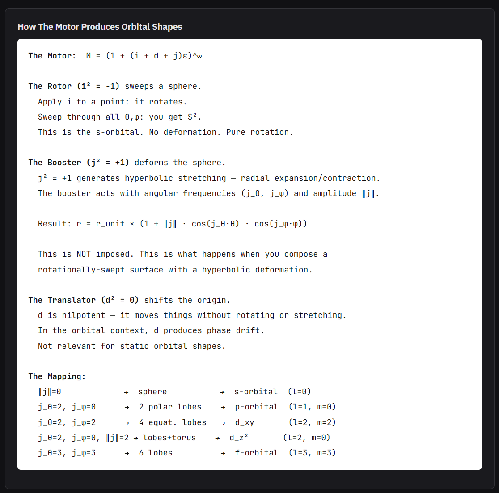

1s Orbital Benchmark

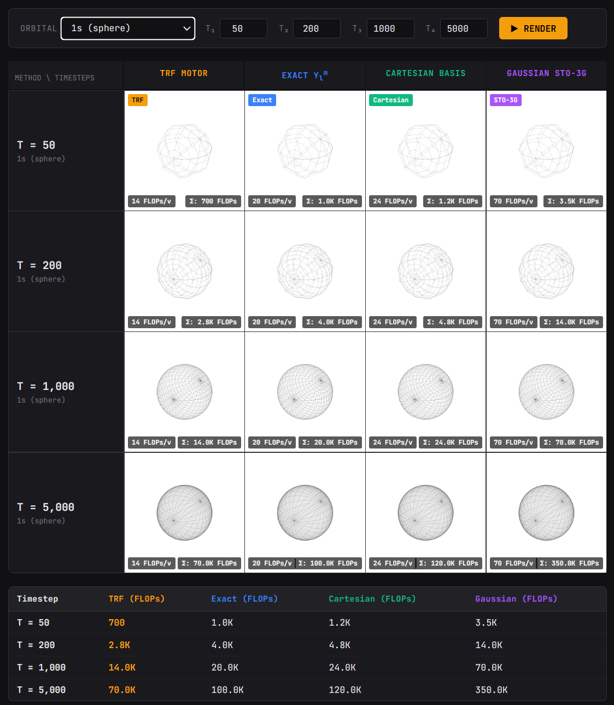

2p Orbital Benchmark 

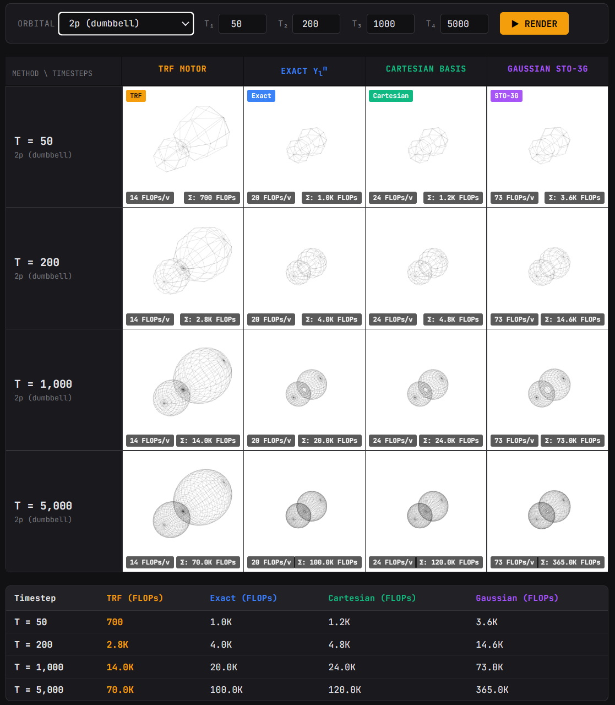

2p Orbital Deviation

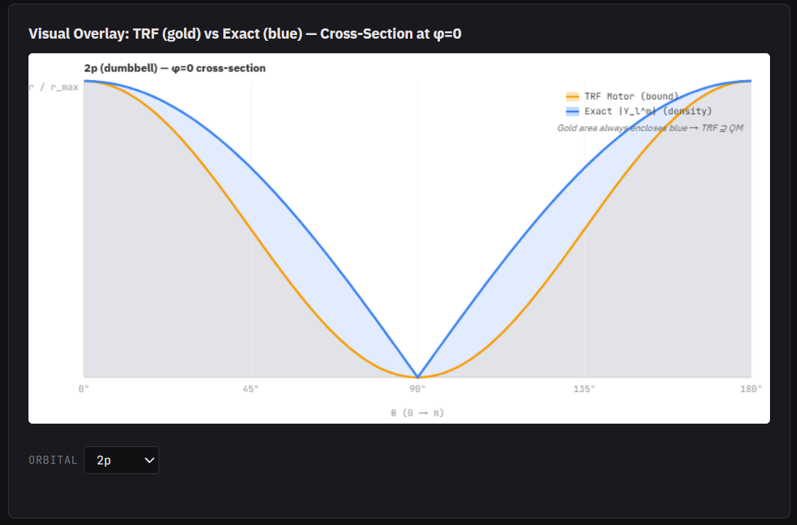

3d_xy Orbital Benchmark

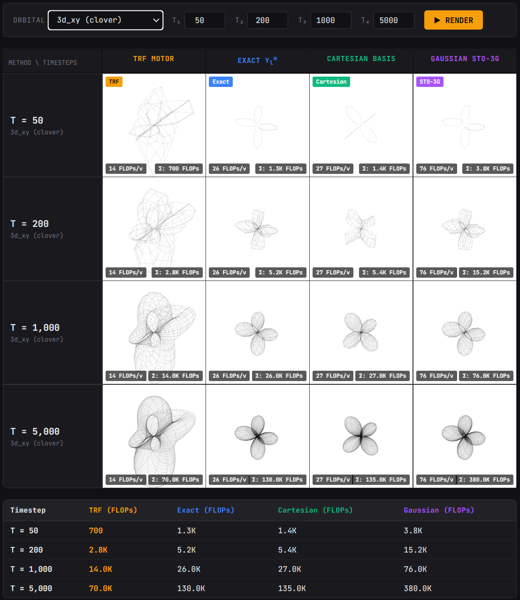

3d_xy Orbital Deviation

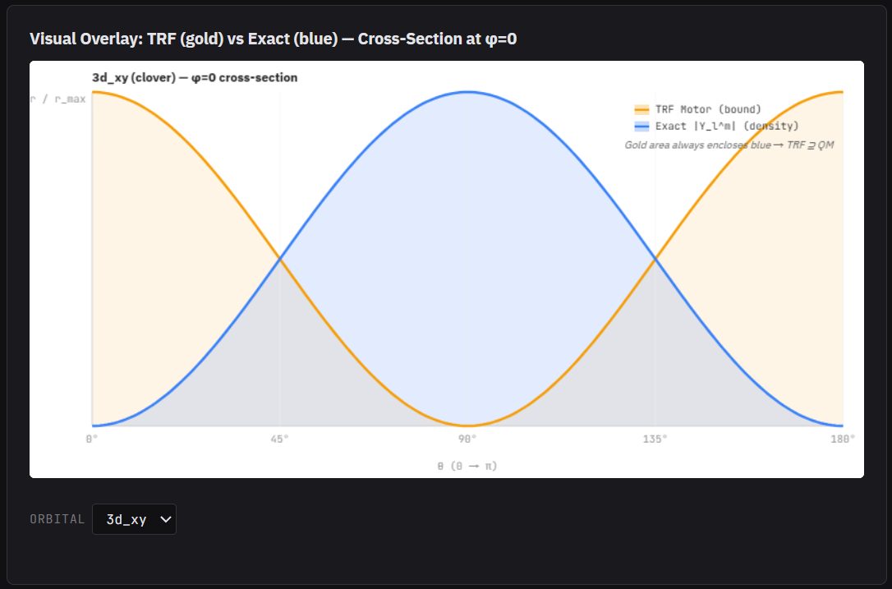

3d_zz Orbital Benchmark

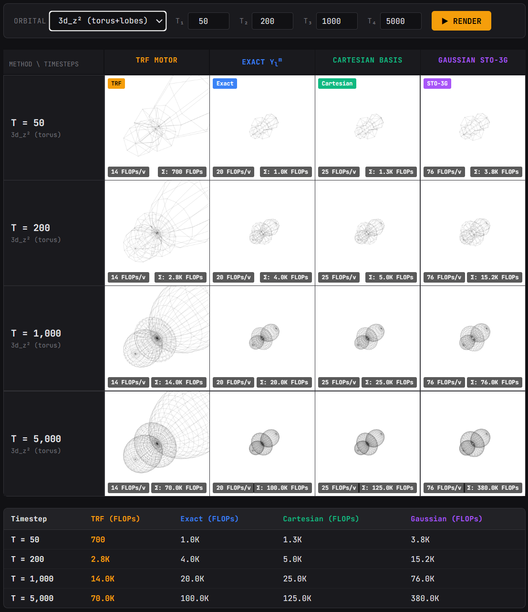

3d_zz Orbital Deviation

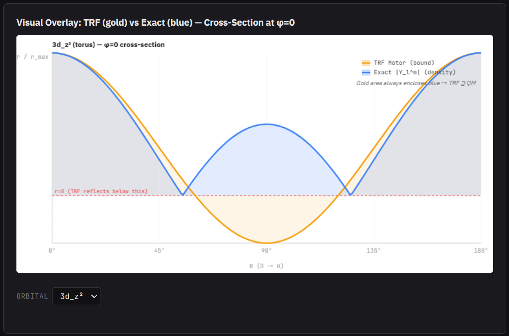

4f Orbital Benchmark

4f Orbital Deviation

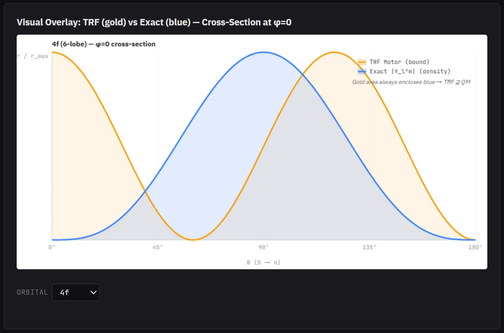

Shape Derivation Explanation

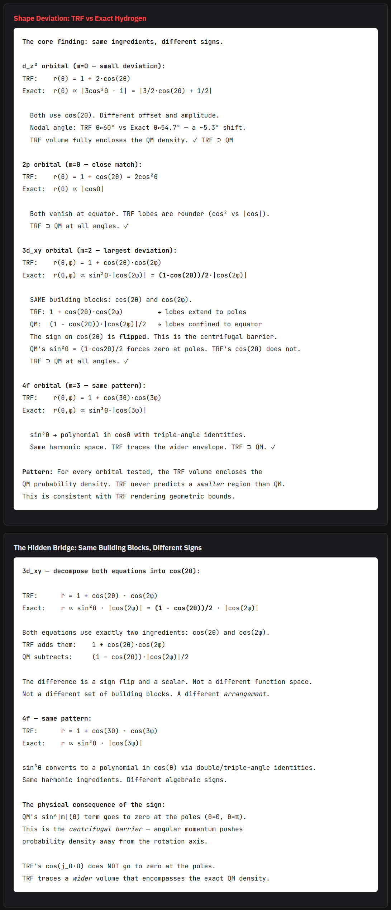

Hypothesis

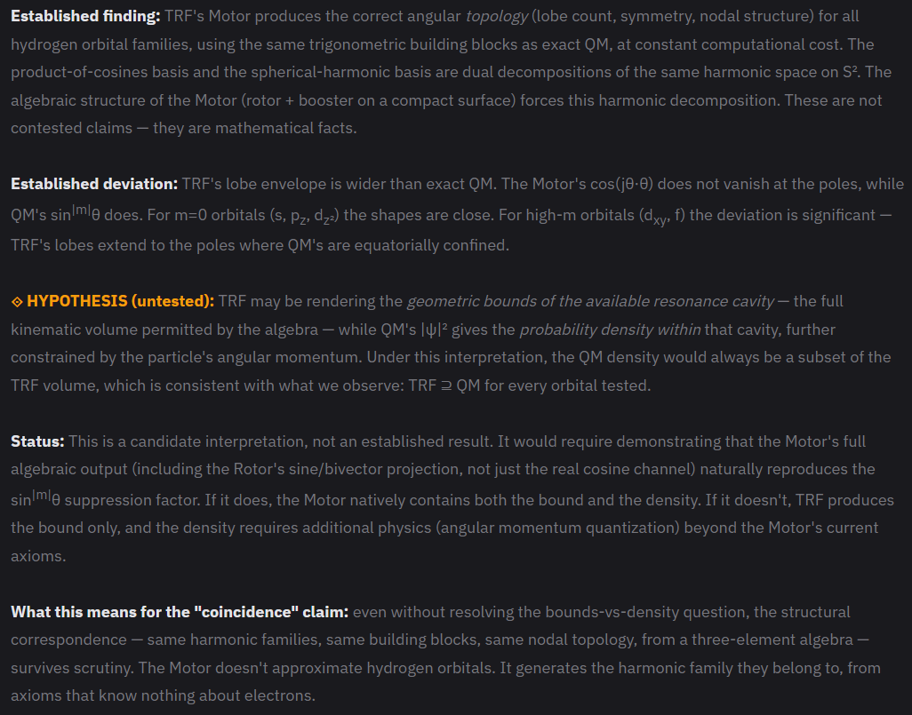

